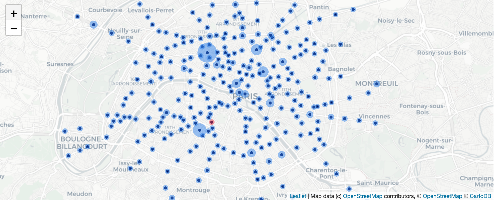

# Paris metro traffic
Data cleaning, analysis and visualization of Paris metro traffic with Python, Pandas, Matplotlib, [iPyLeaflet](https://ipyleaflet.readthedocs.io/en/latest/index.html) & [kepler.gl](https://kepler.gl/).

*Example: Hourly traffic visualized with kepler.gl*

## Source:

Île-de-France Mobilités, formerly STIF, is the organisation authority that controls and coordinates the different transport companies operating in the Paris-area public transport network and Île-de-France region. 

Since 2016, the STIF gives access to some of its raw data through an [opendata portal](https://opendata.stif.info/explore/?sort=modified).

The STIF operates both a road network (bus) and a rail network (train, metro, RER, funicular).

This analysis focuses on the **rail newtork**, and more specifically, on **metro stations within Paris**.

## Datasets:

The STIF provides the following data about the rail network: daily traffic per stop (number of checkins per day and per ticket type), hourly profiles per stop (traffic distribution per hour of a typical day), geographical coordinates (arranged by stop or by line of transport), repositories of all stops (arranged by stop or by line of transport).

Data about daily traffic and hourly profiles is available for the years 2015 through 2018. 

We will focus our analysis on the year **2018**.

For the year 2018, data is split accross 2 datasets, corresponding to the 1st and 2nd semester of the year.

Below are the links to the aforementionned datasets:
- [Daily traffic *1st semester 2018*](https://opendata.stif.info/explore/dataset/validations-sur-le-reseau-ferre-nombre-de-validations-par-jour-1er-sem/information/)
- [Daily traffic *2nd semester 2018*](https://opendata.stif.info/explore/dataset/validations-sur-le-reseau-ferre-nombre-de-validations-par-jour-2e-sem/information/)
- [Hourly profiles *1st semester 2018*](https://opendata.stif.info/explore/dataset/validations-sur-le-reseau-ferre-profils-horaires-par-jour-type-1er-sem/information/)
- [Hourly profiles *2nd semester 2018*](https://opendata.stif.info/explore/dataset/validations-sur-le-reseau-ferre-profils-horaires-par-jour-type-2e-sem/information/)
- [Repository](https://opendata.stif.info/explore/dataset/referentiel-arret-tc-idf/information/)
- [Geographical coordinates](https://opendata.stif.info/explore/dataset/emplacement-des-gares-idf-data-generalisee/information/)

## Purpose:

- Clean & wrangle available data to visualize & analyze the traffic within the Paris metro network in 2018.
- Use Matplotlib, [iPyLeaflet](https://ipyleaflet.readthedocs.io/en/latest/index.html) & [kepler.gl](https://kepler.gl/) to produce visualizations.

*Example: Traffic visualized with iPyLeaflet*

## Notebooks:

This project consists of 4 separate notebooks:
- [Notebook 1/4](https://github.com/fannykassapian/metro-traffic-data-analysis/blob/master/1_intro_exploration.ipynb): General introduction and initial data exploration
- [Notebook 2/4](https://github.com/fannykassapian/metro-traffic-data-analysis/blob/master/2_cleaning_1.ipynb): Data cleaning (daily traffic and hourly profiles)
- [Notebook 3/4](https://github.com/fannykassapian/metro-traffic-data-analysis/blob/master/3_cleaning_2.ipynb): Data cleaning (Repository and geographical coordinates)
- [Notebook 4/4](https://github.com/fannykassapian/metro-traffic-data-analysis/blob/master/4_analysis_visualization.ipynb): Analysis and visualization
